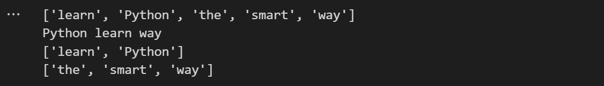
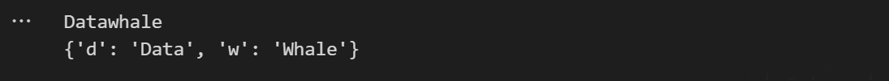
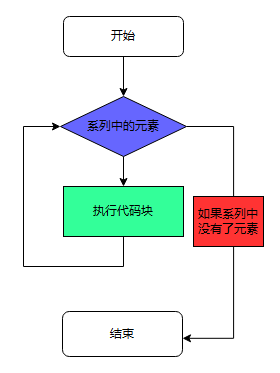
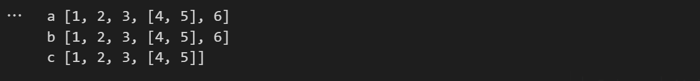
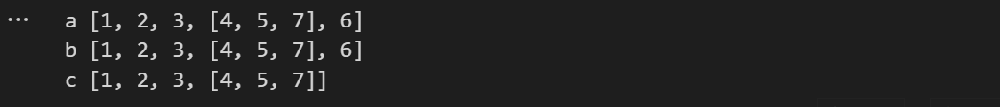

[toc]
# 1. print()与注释
## 1.1 第一个程序
````python
print('hello, world')  # 我是一个单行注释
````

- 每一个 `print()`会默认换行，`end = ''` 表示以空格结尾，结果是不换行
````python
print('Datawhale', end = '')  
````


- 打印多个内容时是以空格分隔的
````python
print('Data', 'whale')
````


- 设置 sep 的值以修改分隔符
````python
print('Data', 'whale', sep = '*')
````


# 2. 列表与字典
- **列表**是一种可变的序列，它是一种**容器**，容器的唯一作用就是打包，解包，内容传递
## 2.1 列表
````python
p2s = ['learn', 'Python', 'the', 'smart', 'way']
print(p2s)
print(p2s[1],p2s[0],p2s[-1])  # 列表的序列，python默认从0开始
print(p2s[0:2])  # 切片使用列表
print(p2s[2:])  # 从第三个到最后一个元素
````

## 2.2 字典
````python
dw_set = set()  # 集合
for i in 'Datawhale':
    dw_set.add(i)
print(dw_set)
````

- a在这里只出现了一次，集合中不包括重复元素
- 字典是键值对的集合
````python
dw_dict = {'d':'Data', 'w': 'whale'}
print(dw_dict['d'], dw_dict['w'], sep = '')
dw_dict['w'] = 'Whale'  # 字典的更新
print(dw_dict)
````

# 3. if 与 for
## 3.1 if 语句
````python
if condition:
    statements
else:
    statements
````

## 3.2 for 语句
````python
for variable in sequence:
    statements
else:
    statements
````

````python
for row in range(10):
    for col in range(row):
        print('🏀',end = '')
    print()
````

- 切分函数
````pthon
print('我，秦始皇，v我50，吃肯德基'.split(','))
````

# 4. 函数与 return
## 4.1 定义一个ReLU函数
````python
def ReLU(x):
    if x > 0:
        return x
    return 0

print(ReLU(-9))
print(ReLU(8))
````
## 4.2 匿名函数
````python
relu = lambda x: max(x,0)
print(relu(-9))
````
## 4.3 回调函数
> 回调函数就是一个通过函数指针调用的函数。如果你把函数的指针（地址）作为参数传递给另一个函数，当这个指针被用来调用其所指向的函数时，我们就说这是回调函数。回调函数不是由该函数的实现方直接调用，而是在特定的事件或条件发生时由另外的一方调用的，用于对该事件或条件进行响应。
# 5. 一种基于深度抄袭的机器学习时间特征提取技术
## 5.1 直接赋值
````python
a = [1,2,3,[4,5]]
b = a
id(a) == id(b), id(a)
````

## 5.2 浅度抄袭
- b = a实际上是是b和a都指向同一个内存地址，对a的值的修改等价于对b的值的修改
- 下面使用两种赋值方法对b和c进行赋值
````python
a = [1,2,3,[4,5]]
b = a
c = a.copy()
a.append(6)
print('a',a)
print('b',b)
print('c',c)
````
- c并没有跟随a的变动而变动

- 对比下面的情况

````python
a[3].append(7)
print('a',a)
print('b',b)
print('c',c)
````
- 对a进行处理后b与c的值均发生变化

## 5.3 深度抄袭
- 使用copy中的deepcopy（）可实现深度复制

````python
import copy
d = copy.deepcopy(a)
print(d)
a[3].append(8)
print(d)
````
- 可以发现d的值不会随着a的值的变化而变化

# 6. 面向对象-托马斯和他的伙伴们
## 6.1 导入库定义Train类
````python
from random import choice
import time
from tqdm import tqdm
from IPython.display import display,HTML

class Train:
    def __init__(self,name,*goods,naughty=True):
        self.name = name
        self.goods = goods
        self.naughty = naughty

    def __getitem__(self,idx):
        if self.naughty:
            return choice(self.goods)
        return self.goods[idx]
    
    def __len__(self):
        return len(self.goods)
    
    def info(self):
        if self.name == '托马斯小火车':
            return f'Hi,我是{self.name}.'
        return f'Hi,我是{self.name}.'
    
    def 发车(self,string):
        print(f'{string},上山')
        for i in tqdm(range(30)):
            time.sleep(0.1)
        display(HTML("<video controls width=1200 src='train.mp4'>train</video>"))
````
## 6.2 实例化
```python
Edward = Train('Edward',1,2.5,9,114,514,naughty=False)
```
- 获取info

````python
Edward.info()
````

- 货物数量
````python
len(Edward)
````

- 解包与打包
````python
m,n = Edward[3],Edward[4]
print(m,n)
````

- 托马斯小火车

````python
items = ['email','rice','focil','LSLS']
Thomas = Train('Thomas',*items,naughty=True)
Thomas.info()
````

````python
len(Thomas)
````

````python
Thomas[2]
````

- 这里调用Thomas[2]输出的值是随机的，是由__getitem__()函数决定的
````python
Thomas.发车('AE86')
````


